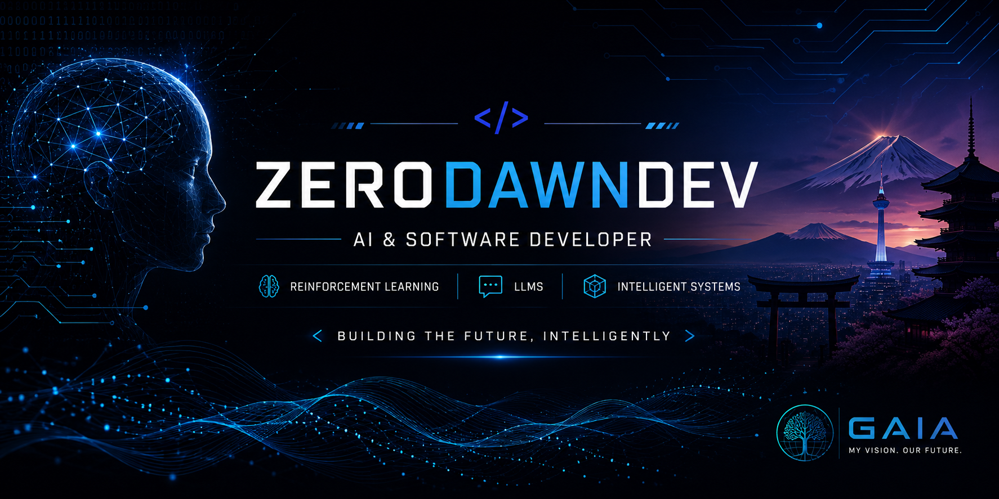

  

<h1 align="center">Hi, I'm Allen Adhvaith 👋</h1>

  AI Master's Student in Japan 🇯🇵 | AI & Software Developer | Building Intelligent Systems

---

##  About Me

* 🎓 Master's Student in Artificial Intelligence, Kyoto
* 💻 B.Tech in Computer Science and Engineering
* 🤖 Building AI-powered applications and intelligent assistants
* 🌱 Currently learning Reinforcement Learning and Large Language Models
* 📍 Based in Kyoto, Japan

---

## 🛠️ Tech Stack

### Languages

* Python
* JavaScript
* TypeScript
* Dart
* Java

### AI & Machine Learning

* PyTorch
* TensorFlow
* Stable-Baselines3
* NumPy
* Pandas

### Development

* Flutter
* React
* Next.js
* Git
* GitHub

---

## 📌 Current Projects

### GAIA

Personal AI Assistant focused on intelligent interaction and automation.

### Reinforcement Learning Research

Exploring PPO and custom environments for intelligent decision-making systems.

### AI & Software Development

Building practical software solutions using modern technologies and AI.

---

## 🌱 Currently Learning

* Large Language Models (LLMs)
* Advanced Reinforcement Learning
* AI Agents
* System Design
* Japanese Language 🇯🇵

---

## 📫 Connect With Me

* GitHub: @ZeroDawnDev
* Email: allenadhvaithplpy@gmail.com

---

  <i>Learning by building.</i>

